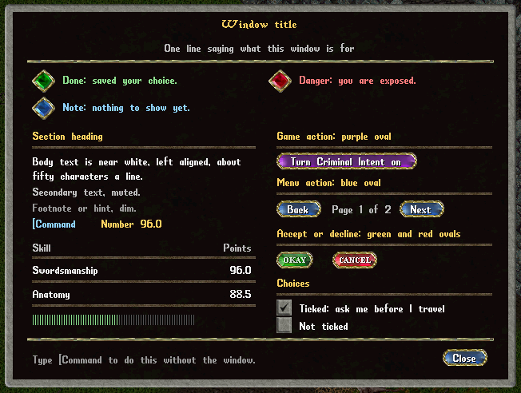
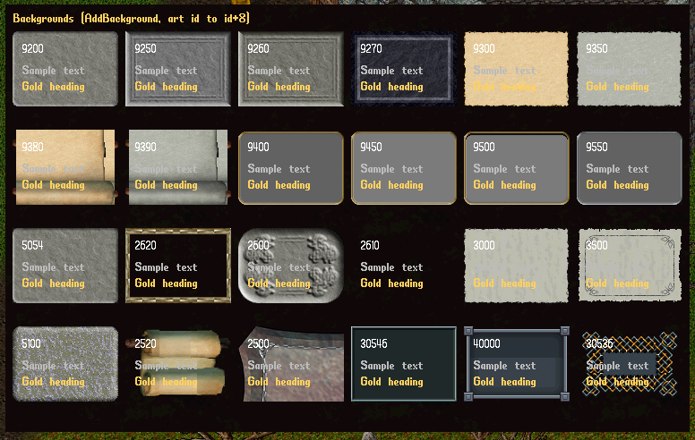
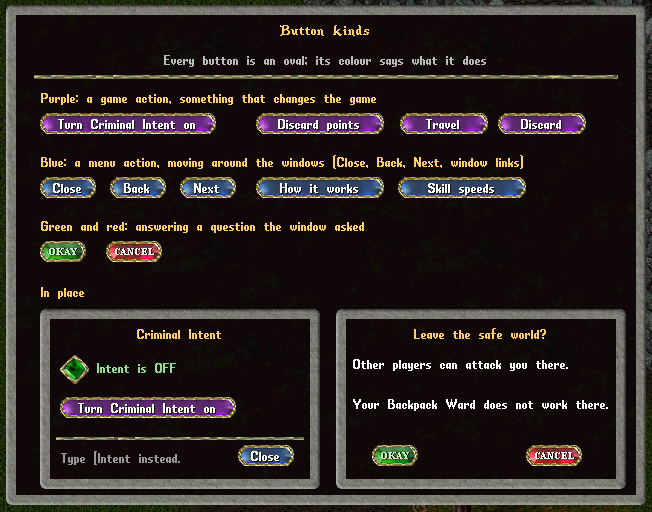
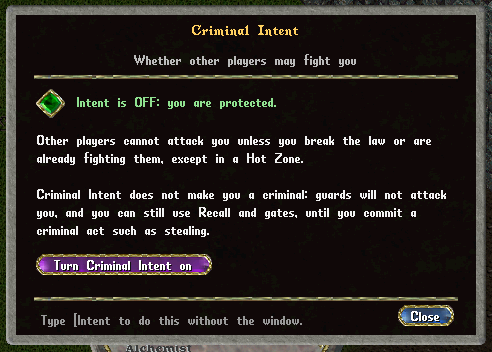
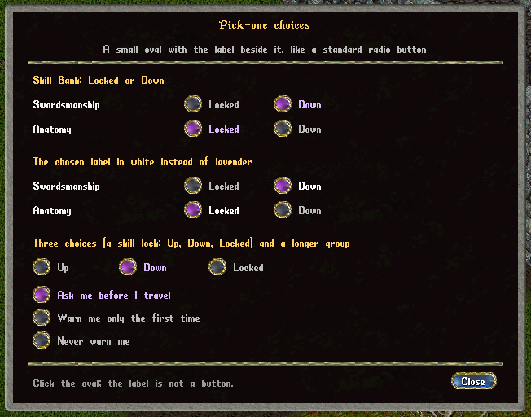
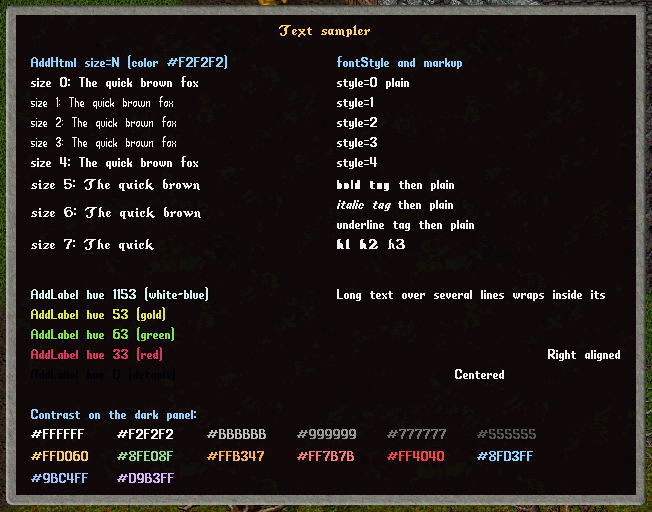

# UO Rekindled window style guide

Status: **approved by the owner on 2026-10-07 ("Approved, style pass can proceed") and applied to every shard window the same day (section 9, evidence in `Gump-Style-Pass.md`). `GumpStyle` is the one place that implements it, and `StyleGuideTests` fails the build when a window goes back on a rule below. The pass was committed, pushed and deployed on 2026-10-07 (the button art is already in the client dist).** Every picture in this guide was drawn in the real ClassicUO client (the fork the players use) from the test windows in `tests/scenarios/gump-style/`. Where the finished windows differ from a number in the first draft of the guide, the numbers below are the ones the code uses (section 12, last entry).

The owner's ask (2026-10-07): "a style guide for making gumps so that there is a consistent look for the shard. Look for the best gump elements and good UX."

## 1. What this is built from

- An audit of all 11 shard windows (what each does and where they disagree): section 8 keeps the findings that matter.
- A measured look at the art the client really has (frames, buttons, rules, tabs, choices) and what each looks like drawn: sections 3 and 4.
- Outside research on UX for dialogs in a fixed-size game UI (WCAG contrast, Xbox and Game Accessibility Guidelines, Nielsen Norman Group on confirmations, proximity and empty states) and on how classic UO and ModernUO windows are built: section 6 maps each principle onto a window.
- The client's own source (our fork), read for what text and gump controls can and cannot do: section 7.

## 2. The look in one paragraph

A dark panel in a stone frame (what the guide window already is), one gold title in the display font, a muted line saying what the window is for, a gold rule, then content in plain white on the dark panel, a footer rule, a dim hint on the left and a blue Close oval on the right. Status is a gem plus a word in a colour. Headings are gold, with a thin rule under them. Every button is an oval and its colour says what it does: green accepts, red declines, blue moves around the windows, purple changes the game.

## 3. Decisions the guide makes

| Area | Rule | Why |
| --- | --- | --- |
| Frame | `AddBackground 9200` plus `AddImageTiled 2624` inset 10 px (what `GumpStyle.Frame` does today). Always opaque. | The only combination where every text colour passes WCAG AA (white 19.8:1, gold 13.6, muted 10.3, dim 6.9 on the dark tile). White on bare stone is only 3.4 to 4.2. |
| Alternative frame | Slate: `9270` alone, no tile. | Same contrast (white 14:1), a cooler, quieter look. Not chosen (section 5). |
| Never | Frames 30546 and 40000 (need modern 7.x client data on every player's machine), scroll art (9380, 9390, 2520, 5170), part sets (2560, 2610, 5040, 2603), 2620 (centre glitch), `AddAlphaRegion`. | They break or vanish on some clients, or make the whole panel half see-through. |
| Window classes | Large 640x500 (guide, Skill Bank, Mastery); Medium 480 x 260 to 480 (status windows); Dialog 440 x 300 (confirms). Each class has one fixed first-open position. | Today there are four sizes and five origins for one family. 640x500 is kept (a 640x480 limit would force re-flowing the guide for players with the smallest client window); nothing may be taller. |
| Margins | Frame inset 10; content margin 34 left and right (`GumpStyle.Margin`, the same x as the footer hint); rules run 28 to w-28. | Text left margins before the pass were 20, 24, 25, 30 and 36. |
| Header | Title: display font (`size: 5`), gold `#FFD060`, centred, y 16. Subtitle: default font, muted `#BBBBBB`, centred, y 46, one line, no full stop. Gold rule (art 2700, 4 px) at y 70. Content starts at y 82. | One header everywhere (the three camp and travel dialogs use a small title, a different subtitle y and colour, and no rule today). |
| Footer | Gold rule at h-62; hint left at x 34, y h-44; buttons right, y h-48. | One footer everywhere. |
| Text sizes | Three only: display (`size: 5`) for titles; default for everything; small (`size: 1` to `3`) only for non-essential hints. | `size: 4` is the same font as the default and `fontStyle` is ignored by the client, so today's "headlines" differ from body text only by colour. |
| Emphasis | Colour (gold) and the rule under a heading. **Never bold:** `<B>` turns rounded letters into solid blocks in our client ("Done" reads "D■■e"). Never `fontStyle:`. **Never italics** (owner ruling 2026-10-07: they look poor in this font; command lines and hints are plain, in the dim or Command colour). The only allowed `<B>` is the progress bar of pipe characters. | Verified in the client (picture below). |
| Colour | Section 3.1. Always `#RRGGBB`, never an unset colour (unset text renders near black). | |
| Choices | A tick box `210/211` for an independent yes/no ("Do not warn me again"); **radio ovals** (a round purple or stone dot with the label beside it) for pick-one (section 3.2a). | The round radio art (`208/209`) is a light ball against a dark ball and is hard to read as "selected", and a row of tick boxes for either/or (Locked, Down) makes the player read two boxes to find out which one. |
| Buttons | Section 3.2. | |
| Banners | Section 3.3. | |
| Tabs | Stone tab art `5007` (closed) and `5006` hued 47 (open), 88 px, as the guide has them. | The only tab art that fits six across 640 px. |
| Rows | A thin brown rule (art `96`, 3 px) under each row, numbers right-aligned in fixed columns, header row in muted. The pitch follows the row: **30 px** for a one-line row (Skill Bank), **34 px** for a row with a second line under the name (Mastery), **44 px** for a camp entry with its place line. | The first draft said 36 px everywhere; a one-line row that tall wasted the page, and the Skill Bank's two radios and Discard fit a 30 px row with a rule under it. Click targets stay above the 24 px of WCAG 2.5.8. |
| Line length | 50 to 70 characters a line; plan 6.9 px per character, so a 400 px column is about 58 characters, 440 px about 64. One shared estimator in `GumpStyle` replaces the two (58 and 52) in use. | |
| Contrast | Nothing dimmer than `#999999` on the dark panel. `#777777` and `#555555` are for the unfilled part of a bar only. | |
| Exits | Every window has a visible **Close** (or **Cancel**), and right-click (button 0) is always safe: it closes, and from a sub-window it goes back to the parent. Esc does not close server windows in our client, so help text says "right-click or press Close". | Today the camp list and the Discard window have no visible close; Discard's right-click leaves the bank window shut. |
| After an action | The window is re-sent with a result banner in the same place (a Reply button always closes the gump, so "stay open" means "send it again"). | |

### 3.1 Colours (final set)

| Role | Hex | Use |
| --- | --- | --- |
| Gold | `#FFD060` | Titles, headings, the primary action's label, numbers that matter |
| Text | `#FFFFFF` | Body, row names |
| Muted | `#BBBBBB` | Subtitles, secondary lines, column headers, labels of unselected choices |
| Dim | `#999999` | Footer hints, footnotes (the lowest allowed) |
| Command | `#8FD3FF` | `[Commands`, and the **Note** banner |
| Chosen | `#D9B8FF` (lavender) | The label of the chosen radio only. Tabs and the guide's topic list are unchanged (amber open tab, gold chosen topic) |
| Good | `#8FE08F` | Protected, saved, ready, claimed (**Done** banner) |
| Danger | `#FF7B7B` | Exposed, refused, destructive actions (**Danger** banner), replaces both `#FFB347` amber and `#FF4040` red |

Gold and amber differ by only a few units for the common kinds of colour blindness, and green and amber collapse too. So the amber "Warning" goes: **colour is never the only signal**, every state also has a word ("Done:", "Danger:", "Note:", "ON", "OFF") and, in banners, a gem. The state a colour tells is risk, not on or off (Intent OFF is Good, Intent ON is Danger, because on exposes you).

### 3.2 Buttons: one family of ovals, told apart by colour

A player should be able to tell at a glance what a button does. Every button is the same oval (the stock OKAY/CANCEL shape and rim), and its **colour** says what it is for (owner rulings 2026-10-07: game action purple; the classic green and red for answering; Close in the oval style):

| Colour | Kind | Art | Used for |
| --- | --- | --- | --- |
| **Green** | Accept | Classic **OKAY** `2450/2451` (word in the art) | Answering a question the window asked (a confirm dialog). OKAY on the left, CANCEL on the right, at opposite ends of the footer, so the consequential button is never next to the benign one. |
| **Red** | Decline | Classic **CANCEL** `2453/2454` (word in the art) | The other half of that question. |
| **Blue** | Menu action | Blank steel-blue oval, five widths | Moving around the windows: **Close**, **Back**, **Next**, "Next topic", "How it works", "Skill speeds", "Open Mastery", "Select" (a camp to travel to; the game question comes next), and the guide's **topic list** (176 px ovals; the chosen topic's oval is the pressed picture with a gold label). Never changes the game. |
| **Purple** | Game action | Blank purple oval, five widths | Anything that changes the world or the character: "Turn Criminal Intent on", "Turn the warning off", "Discard", "Travel". At most one or two per window; the left-most is the main one. |

Labels on the blue and purple ovals are white with a dark emboss (the same words in `#101010` one pixel down and right, drawn first), centred on the oval. Sentence case.

Close is a blue oval in the lower right of every window. It is not red: red CANCEL means "decline this question", and a window with no pending question has nothing to decline. Back and Next are blue ovals with "Page n of m" between them (the same words and positions in Skill Bank and Mastery; the guide pages topics with them). A pick-one choice is a set of radio ovals with their labels beside them (section 3.2a); an independent yes/no is a tick box `210/211` with its label to the right.

**Widths:** 56, 88, 128, 176 and 232 px, the narrowest that fits (letters x 6.3 px + 20, `GumpStyle.OvalWidth`): "Close", "Back" and "Next" use 56; "Discard" 88; "How it works", "Skill speeds" and "Discard points" 128; "Turn Criminal Intent on" 176; a full sentence 232. A test (`StyleGuideTests`) checks every label in the windows against its oval. The blue and purple ovals are blanks cut from the stock CANCEL oval (its own gold rim and glossy ends, the word removed, the red recoloured).

**Words:** Close, Back, Next, the verb itself on a game action. On a dialog the pair is always OKAY and CANCEL; nothing else is called OK, Done, Exit, Yes or No.

**Retired:** the small curved arrow `4005/4007` (owner: "I don't love it"), the stone plates `2443/2444` of the first draft, and the gold DELETE-style banner (built and pictured as an alternative for the game action; the owner chose the purple oval).

**Art ids.** `62010`-`62019` (blue ovals) and `62020`-`62029` (purple ovals) are reserved for shard window art (the stock archive ends at 61728; the buff icons use `50000`-`50002`); for width k, id `base + 2k` is the normal picture and `base + 2k + 1` the pressed one. They are cut from the stock art by `tools/gump-art/make_window_buttons.py`, committed in `data/client/gumps/`, and copied into the client's `Data/Gumps/` at a deploy with `cuo.dll`. A window drawn on a client without the files shows no button, so a test (`GumpStyleArtFilesTests`) checks they exist and read back whole.

Click targets are the whole art rectangle (21 px ovals, 19x20 tick). Keep at least 36 px between rows of targets and put the art next to its label; a label beside a tick is not clickable.

### 3.2a Pick-one choices (radio buttons)

The owner asked (2026-10-07) for something better than tick boxes for a pick-one choice such as the Skill Bank's **Locked** or **Down**, then refined it: a small empty oval with the label beside it, 22 px wide so it reads round, and finally **purple instead of amber**: "The gold text and selected radio color gets confused with the title text color. I think purple is a better color as it's already associated with game actions." That is the final design:

- Each choice is a **small empty oval, 22 px wide and 21 px tall** (round, with the same gold rim and gloss as the other ovals) with its **label beside it**, 8 px to the right of the oval.
- The chosen choice's oval is **purple, the same purple as a game action**, and is only a picture: it does nothing when clicked. Its label is **lavender** (`#D9B8FF`).
- The other choices' ovals are **dull stone** buttons, with a muted label (`#BBBBBB`). Clicking one chooses it: the window is re-sent and that oval turns purple.
- **Purple means "you chose this, it counts in the game"**: a pick-one sets how the game treats you, so it shares the colour of the buttons that act on the game. It never looks like a title, because gold is kept for titles, headings and numbers.
- It reads without relying on colour alone: purple dot against dull stone, lavender word against grey.
- It is placed in a row for a short group (Locked, Down; or Up, Down, Locked, about 100 px per choice) and in a column for a list of longer options ("Ask me before I travel", "Warn me only the first time", "Never warn me"; 28 px between choices).
- **The oval is the button; the label beside it is not clickable** (a limit of the gump system: only art can be a button). Keep the oval and its label together.

Tick boxes stay for **independent** yes/no options ("Do not warn me again when travelling"), where each box stands alone.

Rejected looks, drawn in a Skill Bank row for comparison: the tick boxes of today (two boxes to read to find out which one is chosen), wide full-word pills, the guide's stone tabs, the stock skill-lock icons (9 to 12 px, the state only a gold word), the stock radio dots `5002/5003` (small and grey, the on state a dark cross), and the first amber version of the radio oval (its gold looked like the titles).

### 3.3 Banners

At y 82 under the header rule, same spot in every window: a gem (`5826` green, `5830` red, `2151` blue), a word, and the sentence, in the status colour. **Done:** an action worked. **Danger:** a refusal or a risk. **Note:** a fact ("Nothing is banked yet"). One line where it can be (60 characters or fewer); a longer sentence takes two or three lines beside the gem, which stays centred on them (the Skill Bank's result line, the Hot Zone warnings). The status windows (Intent, Travel warning, Ward) show the state as a gem and a word, and the Skill Bank and the confirm dialogs show results and risks as banners.

### 3.4 Confirm dialog

Title names the action and the object ("Discard 12.3 points?"). The body says what will happen and whether it can be undone. The confirm button is the verb; its partner is **Cancel** (or the reverse verb, "Keep points"). The two sit at opposite ends of the footer. A destructive confirm uses the Danger colour for its heading line and nothing else. An optional tick box ("Do not warn me again") sits above the footer rule, and a typed confirmation, when one is needed, sits above it in a tick-box-height well. Right-click always means cancel. A dialog that asks about something that happens only to the clicking player is never shown to anyone else, and it never blocks play.

### 3.5 Empty state

Centre of the list area, muted, three parts in one short paragraph: what is empty, why, what to do ("Nothing is banked yet. Set a skill to Down and train another to bank points here.").

### 3.6 Overhead text and journal lines

Overhead labels: neutral information in `0x3B2` (the journal grey-white), anything dangerous or refused in `0x22` (red). Journal messages follow the same two: refusals and cancellations red, everything else default, never green. Nothing player-facing mentions a UTC time unless it also says how long it is.

## 4. What the art looks like (checked in the real client)

All ids are decimal. "Use" is what the guide adopts.

| Piece | Art | Use |
| --- | --- | --- |
| Window frame, opaque | `9200` + tile `2624` | Default |
| Window frame, slate | `9270` | Alternative |
| Rule, horizontal | `2700` (521x4), tile it across | Header and footer rules, section rules |
| Row rule | `96` (179x3) | Table row separators |
| Blue ovals (custom blanks) | `62010`/`62011` 56 px, `62012`/`62013` 88, `62014`/`62015` 128, `62016`/`62017` 176, `62018`/`62019` 232, all 21 px tall | Close, Back, Next, window links |
| Purple ovals (custom blanks) | `62020`/`62021` 56 px, `62022`/`62023` 88, `62024`/`62025` 128, `62026`/`62027` 176, `62028`/`62029` 232, all 21 px tall | Game actions |
| Accept and decline | `2450/2451` OKAY, `2453/2454` CANCEL | Dialogs |
| Tick box | `210` off / `211` on | An independent yes/no |
| Radio ovals (custom blanks) | purple `62030` (the chosen one, a picture; `62031` unused), stone `62040`/`62041` normal and pressed (the others, buttons), all 22 px wide and 21 px tall | Pick-one choices |
| Tabs | `5007` closed, `5006` open (hue 47, amber, as today) | Chapter tabs |
| Gems | `5826` green, `5830` red, `2151` blue | Banner marks |
| Text entry well | `2524` tiled | Discard's typed confirmation |

Anything in the sampler that did not render (frames 2560, 2610, 5040; 2603 lacks two pieces) or that is misleading (ModernUO's own dev-doc captions for 5054, 9250, 3600 and 4005 are wrong) is on the "never" list. Optional later: the client can load shard art from `Data/Gumps/<id>.gump` (already used for the buff icons, ids from 50000); a reserved range above 61,728 would hold a 1-px rule or a wide labelled plate if ever wanted. Nothing in this guide needs it.

## 5. The frame

**Stone** (chosen by the owner, 2026-10-07): the current dark panel in a stone frame, best contrast of everything measured. **Slate** (`9270` alone, no tile; a cooler, quieter frame with the same readability) was the alternative and is not pictured any more; every other rule in this guide is the same on either.

## 6. UX principles and where each lands

| Principle | Where |
| --- | --- |
| Contrast 4.5:1 for text, 3:1 for large (WCAG 1.4.3), measured on the worst part of the background | Dark inset behind all text; nothing under `#999999` |
| Do not use colour alone (WCAG 1.4.1, Game Accessibility Guidelines) | A word, and a gem in banners, with every colour |
| Line length 50 to 75 characters | 360 to 440 px columns |
| Line spacing about 1.5 | The client's fixed 18 px line pitch already gives about 1.6; a blank line between paragraphs |
| Confirm only serious or irreversible things; restate the action and consequence; verb buttons; keep the consequential button away from the benign one (NN/g) | Section 3.4 |
| One primary action per window | The left-most purple oval; OKAY and CANCEL on a dialog |
| A visible exit that is always safe (NN/g heuristic 3) | Close or Cancel on every window; right-click always safe |
| Empty states say what, why, next (NN/g) | Section 3.5 |
| Feedback after an action in a fixed place (NN/g heuristic 1) | Banner, section 3.3 |
| Consistency of words and places (NN/g heuristic 4) | The word list in 3.2, the grid in section 3 |
| Click targets at least 24 px or spaced 24 px (WCAG 2.5.8) | 36 px pitch between targets |
| Text size: PC game guidance asks for much larger text than UO's 11 to 12 px fonts, and the fork has no scaling | Use the default font for anything that matters and size 1 to 3 only for hints; this is a named limit of the era's font, not a choice |

## 7. What the client can and cannot do (drawn, not assumed)

- `AddHtml` text: three real sizes only (`size` 0 or 4 or unset is the default font; 1 to 3 is small; 5 and up is the display font). `fontStyle`/`STYLE=` do nothing. `<I>` draws, but the owner does not want italics; `<B>` is unreadable; `<U>` shows no underline; `<H1>` to `<H3>` are the display font. The colour must be given: unset renders near black. Text outside its box is clipped silently; a scrollbar eats 16 px of width.
- `AddLabel` (a hued label) is a fixed font with an outline and a limited hue palette; the guide uses `AddHtml` only.
- `AddAlphaRegion` makes every control drawn before it that overlaps it half transparent, including the whole frame. Banned.
- A Reply button sends the response and then closes the gump. Page buttons switch client-side and keep the window.
- Right-click on a gump sends button 0 and closes it. Esc does not.
- The client remembers where a player dragged a window, per window type, so the first-open position matters once.
- Missing glyphs (do not type them): ✓ ✗ ► ▪; the block █ is too coarse for a bar.
- A drawn tick for either/or choices is clearer than a ball; a light square is clearer than a gem for "off".

## 8. What the audit found (the problems this guide fixes)

1. Three dialogs (camp travel list, camp travel confirm, Hot Zone warning) are half see-through because of `AddAlphaRegion`; the rest are opaque.
2. Two header treatments: the shard frame (display-font gold title, muted subtitle at y 44) and the three older dialogs (small title, different subtitle height and colour, a red title on the warning).
3. Confirm and Cancel look the same (two green arrows). Discard uses coloured labels, Travel uses plain white; the camp list has no Close at all.
4. Four window sizes and five first-open positions.
5. Skill Bank and Mastery page with unlabelled arrows (the next arrow is the same art as Close), "Page n of m" in one and "n of m" in the other, at different x.
6. The type hierarchy does not render (bold and size 4).
7. Colours: `#FF4040` and `#CCCCCC` bypass `GumpStyle`; amber and red both mean "warning"; two mutes.
8. Results appear in three places: a line inside the window (Skill Bank), a headline flip (Intent) and the journal in red (camp travel, Execute).
9. Left margins of 20, 24, 25, 30 and 36; a hint box (300 px) narrower than its text on the Intent window; Skill Bank's hint column overlaps its notice box; Mastery's "To go" overlaps "This cycle" by 2 px; dead space at the bottom of Discard and in a tab with few topics; Mastery with no rows is empty below y 142.
10. Two line-length estimators (58 and 52 characters).

## 9. How the pass went (approved and done 2026-10-07; the plan as signed off)

**Step 1, `GumpStyle` becomes the whole style** (no player-visible change by itself): the colours in 3.1 (Warning and the stray hexes go), window classes and origins, rule and margin constants, one text-width estimator, and helpers: `Frame` (adds the header rule), `Footer` (rule, hint, Close oval), `Banner(kind, text)`, `SectionHeading`, `Table` helpers (header, row, row rule, right-aligned column), `GameAction(label)` (purple oval), `MenuAction(label)` (blue oval), `OkayCancel`, `Pager`, `ChoiceRow`, `EmptyState`, and a `ConfirmWindow` base for dialogs (title, body, optional tick box, optional typed confirmation, confirm and cancel words, danger flag).

**Step 2, restyle the windows in order of how visible the difference is:**

| Window | Changes |
| --- | --- |
| Camp travel list, camp travel confirm, Hot Zone warning | Opaque frame, the shared header and footer, OKAY and CANCEL (Travel and stay), Close on the list, the red title becomes the Danger banner, hard-coded hexes removed; one wording for cancel (a journal line on both or neither) |
| Intent, Travel warning, Ward | Gem banner with the state in words, oval Close, hint (a hint box wide enough for its text), the amber/gold headline rules gone |
| Skill Bank | Banner for results, purple Discard on each row, labelled Back/Next with "Page n of m", row rules, tick boxes for Locked/Down, the hint column no longer overlapping the banner, Discard as the shared confirm dialog (typed word kept), right-click returns to the bank |
| Mastery | Same header, table helper (columns that do not overlap), labelled paging, an empty-state line, the footnote moved off the footer |
| Welcome guide, Skill classes | Oval Close/Next/Back, header rule, the Action buttons as blue ovals (they open windows: Skill speeds, Open Mastery), no `fontStyle`, topic titles that fit the 138 px label |
| Stock-style stand-ins | The overhead and journal hues of 3.6 |

**Step 3, keep it consistent:** a test that fails the build on `fontStyle:`, `<B>` outside the bar, `<I>`, `AddAlphaRegion`, the retired arrow art `4005/4007`, the retired plates `2443/2444`, the retired banner art `62000`-`62007`, a hex colour outside `GumpStyle`, and a window taller than 500 or wider than 640; layout tests for the estimator and fit; and a real-client screenshot of every window, before and after, sent to the owner.

No flag is involved (it is the look of windows the shard already has). It was deployed on 2026-10-07. The root `README.md` does not change; the guide's in-game text does not change except the footer hint wording.

## 10. Open decisions for the owner

Answers given by the owner on 2026-10-07:

1. **Frame: A Stone.** (B Slate stays documented as the alternative.)
2. **Drop the amber "Warning" colour:** yes. Good green, Danger red and Note blue, each with a word and a gem.
3. **Game action: purple oval** (chosen 2026-10-07, section 3.2). **Pick-one choice: small radio ovals with the label beside them** (chosen 2026-10-07, section 3.2a).
4. **The guide as a whole: approved 2026-10-07** ("Approved, style pass can proceed"). The pass (section 9) ran as one item: restyle, before and after real-client screenshots sent to the owner, the style test. Nothing is open.

## 11. Tools made for this (kept under `tests/scenarios/`)

- `alpha3-tools/GumpScriptProbe.cs` and `[TestOnlyGump <serial> <script>`: draws a window from a small text file with no rebuild, on a disposable host only. `gump-style/*.gs` are the scripts behind every picture here; `gump-style/gen_sheets.py` regenerates the art sheets; `gump-style/gump_show.ps1` sends a script to a real-client character and takes the screenshot.
- `alpha3-tools/TestOnlyProbe.cs` `[TestOnlyShow <serial> <window> [argument]` opens one real shard window (`welcome`, `skillclasses`, `intent`, `travelwarning`, `ward`, `skillbank`, `discard`, `mastery`, `camplist`, `campconfirm`, `campconfirmhot`, `hotzone`) on a disposable host, with fixed sample data. `gump-style/restyle_shots.py` drives it with `[SetSkill`, `[TestOnlyMasterySeed` and `[TestOnlySkillBankSeed` for a real-client character and photographs every window (`python -u restyle_shots.py before|after <serial> [stage] [window ...]`); `gump-style/make_pairs.ps1` puts the before and after pictures side by side.
- `tests/StyleGuideTests.cs` (the rules as tests) and `tests/GumpStyleArtFilesTests.cs` (the art files exist and read back whole).

## 12. Revision log

- **2026-10-07 evening, owner feedback.** (1) "Is there a better primary action button? The little curved arrow one I don't love. I like the classic green and red buttons (2450 and 2453) for accept and decline. I'm interested in a flavor of 2464 for the primary action." First answer: a blank, taller gold slab cut from the stock DELETE banner (superseded by the next entry's 17 px banner), with the classic **OKAY 2450** and **CANCEL 2453** for accept/decline. (2) "I don't like the italics with this font (for example where the commands are listed), don't use italics." The italic hint lines were only in the proposal pictures, not in any live window; the guide now bans `<I>` (section 3, Emphasis). Hints and command lines are plain, in the dim or Command colour.
- **2026-10-07 later, owner feedback.** "We need a distinction in visuals between menu actions and game actions. In the Criminal Intent menu both 'Turn Criminal Intent On' and 'Close' have the same style. Close could use the same style as Okay/Cancel. I actually like the stock gold banners for game actions like 'turn on criminal intent'." Section 3.2 now has three kinds: **gold banner** (the stock DELETE look, blank, 17 px instead of my taller 22 px copy) for game actions, a **blue oval** (the stock OKAY/CANCEL shape, blank, steel blue) for menu actions including Close, Back and Next, and the classic green OKAY / red CANCEL for answering a question.
- **2026-10-07 later still, owner feedback.** "The game action is supposed to be 2463 or a variant of that, not the one you used." My blank banner had been rebuilt from a colour average of the left end of 2463 and made 17 px tall, so it came out paler and flatter than the stock DELETE. It is now 2463 and 2464 themselves at the stock 15 px height: each stock pixel kept, the word inpainted from the gold on either side of it, the middle stretched to the width needed (so the gold keeps the stock tone and darkens toward the right as the stock one does). The label moved up to suit the shorter banner. Other stock banners are darker (`2466` PREVIOUS, `2469` NEXT are olive; `2460` ADD is pale with a slanted end); if a darker or a paler variant is wanted, the generator can cut it from those instead.
- **2026-10-07, owner feedback, fourth round.** "I'd actually like to see a version of game action that uses the okay/cancel/close style, but with another color to indicate game action (maybe purple?)." Built and pictured: a **purple oval** (the same blank oval as the blue menu one, recoloured, five widths, art `62020`-`62029`) beside the gold banner, in a button-kinds sheet, the Criminal Intent window, the reference sheet and the Skill Bank (where "Discard" is the game action on every row). The guide now offers both for the owner to choose (section 3.2). A 232 px width was added to the ovals for sentences.
- **2026-10-07, decision.** The owner chose the **purple oval** for the game action. The gold banner (`62000`-`62007`) is dropped from the generator, the client data folder and the art test; section 3.2 is rewritten to the single family of ovals.
- **2026-10-07, owner feedback, fifth round.** "I'm interested in if there is a better version of radio buttons you can come up with compared to the checkboxes (for example in the skill bank 'locked' or 'down')." Section 3.2a: five looks drawn in a Skill Bank row; recommended **radio pills** (a lit amber oval for the chosen one, dull stone ovals for the others; art `62030`-`62049`, built from the same blank oval). The Skill Bank sample (`skillbank-stone.png`) now uses them. Awaiting the owner's choice among A to E.
- **2026-10-07, owner feedback, sixth round.** "I like B, but perhaps the pills should be empty (so just a small oval remains with color) and the labels beside it, so that it looks more like a standard radio button selection." Section 3.2a rewritten: a small empty oval (32 px) with the label beside it; amber when chosen (label gold), stone otherwise. The wide amber and stone pills (`62032`-`62049`) are dropped from the generator, the client data and the art test; the Skill Bank sample uses the new look.
- **2026-10-07, owner feedback, seventh round.** "They look okay, but if the width could get a bit smaller so they look more circular that would be better" (32 px), then after seeing 26, 24 and 22 px side by side in the real client: "22px is great, go with that." The radio oval is 22 x 21 px.
- **2026-10-07, owner feedback, eighth round.** "The gold text and selected radio color gets confused with the title text color. I think purple is a better color as it's already associated with game actions." The chosen radio oval is now the game-action purple (art `62030`, rebuilt; the amber radio is gone) with a lavender label `#D9B8FF`. I also proposed purple for the guide window's open tab and chosen topic; the owner declined ("I don't want that. Just the radio button"), so tabs and the topic list are unchanged and the proposal is removed from this guide.
- **2026-10-07, approval and the pass.** "Approved, style pass can proceed." Every shard window was restyled (evidence: `Gump-Style-Pass.md`). Where the finished windows differ from the first draft of this guide: the content margin is 34 px, not 30 (the same x as the footer hint); row pitch is 30 px in the Skill Bank, 34 px in Mastery and 44 px in the camp list rather than 36 px everywhere; the oval width rule is `ceil(letters x 6.3) + 20`; the guide's topic list is blue ovals (the chosen one pressed, gold label) and "Next topic", "Open Mastery" and "Select" are blue ovals; the Skill Bank's Discard is a purple oval named "Discard" on each row and "Discard points" on the confirm dialog (with the red CANCEL); right-click on the Discard dialog goes back to the bank; both camp-travel dialogs and the Hot Zone warning say "You decide not to travel." in red when declined; the Ward's Primed state is a Note (blue) rather than gold; a banner may take two or three lines (section 3.3).
